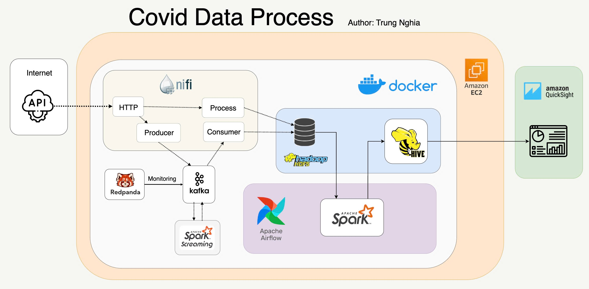
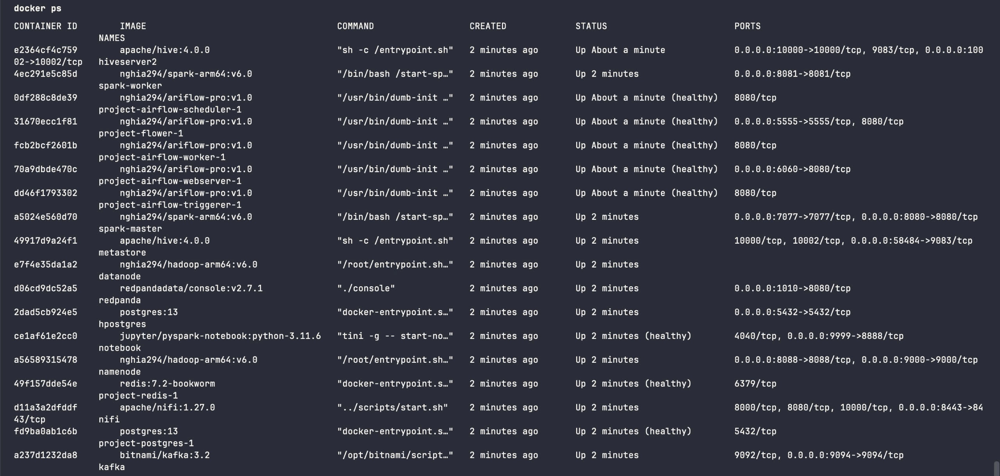

# BIG DATA PROJECT: Covid-Data-Process

# Table of Contents

1. **[Project Objective](#project-objective)**
2. **[Datasets Selection](#datasets-selection)**
3. **[System Architecture](#system-architecture)**
   - [Data Ingestion](#data-ingestion)
   - [Real-Time Data Streaming](#real-time-data-streaming)
   - [Data Storage](#data-storage)
   - [Data Process](#data-process)
   - [Containerization](#containerization)
   - [Data Visualization](#data-visualization)
4. **[Technologies Used](#technologies-used)**
5. **[Installation and Deployment](#installation-and-deployment)**
   - [Set up environment](#set-up-environment)
   - [Running the Project](#running-the-project)
6. **[Troubleshooting](#troubleshooting)**
   - **[Common Issues](#common-issues)**
   - **[Logs and Monitoring](#logs-and-monitoring)**
7. **[Results and Analysis](#results-and-analysis)**
8. **[Future Work](#future-work)**
9. **[References](#references)**
10. **[Authors](#authors)**

# Project Objective
The *Covid Data Process* project aims to design and implement a comprehensive, real-time data processing pipeline specifically tailored to manage the continuous influx of `COVID-19` data. This project seeks to build a scalable and efficient system capable of ingesting, processing, storing, and visualizing `COVID-19` data in real-time, enabling stakeholders to make informed decisions based on the most current information available.

# Datasets Selection
The dataset, sourced from the [COVID-19 API](https://covid-api.com/api), offers comprehensive and regularly updated reports on the global spread and impact of `COVID-19`. It encompasses a wide range of data points that track the pandemic's progression across various regions, including countries, states, and provinces. This dataset captures essential metrics such as the number of confirmed cases, deaths, recoveries, and active cases, providing a granular view of the pandemic's evolution over time.

Data from API format example:
  ```
    {
        "data":
            [
                0:{
                    "date":"2023-03-09"
                    "confirmed":209451
                    "deaths":7896
                    "recovered":0
                    "confirmed_diff":0
                    "deaths_diff":0
                    "recovered_diff":0
                    "last_update":"2023-03-10 04:21:03"
                    "active":201555
                    "active_diff":0
                    "fatality_rate":0.0377
                    "region":{
                        "iso":"AFG"
                        "name":"Afghanistan"
                        "province":""
                        "lat":"33.9391"
                        "long":"67.7100"
                        "cities":[]
                }
                ...
              ]
    }
  ```
# System Architecture
The system architecture for this `COVID-19` data processing pipeline is designed to ensure efficient data ingestion, processing, storage, and visualization. It leverages a combination of open-source technologies and cloud services to provide a scalable, robust, and flexible framework for managing and analyzing large volumes of real-time data.

The system is divided into several components, each responsible for specific tasks within the data process:

<center>
    
</center>

## Data Ingestion:

- **Data Source**: `COVID-19` data is retrieved from the API `https://covid-api.com/api/` using HTTP requests. `NiFi` handles data ingestion, performing initial cleaning and transformation to prepare the data for further processing.

- **Producer/Consumer**: `NiFi` acts as both producer and consumer, forwarding processed data to `Apache Kafka` for streaming.

## Real-Time Data Streaming:

- **Message Brokering**: `Kafka` serves as the message broker, streaming data between system components in real-time.

- **Monitoring**: `Redpanda` monitors `Kafka`’s performance, ensuring system stability.

- **Streaming Analytics**: `Spark Streaming` processes the data in real-time, performing computations like aggregations and filtering as data flows through `Kafka`.

## Data Storage:

- **Distributed Storage**: Data is stored in `Hadoop HDFS`, providing scalable, reliable storage.

- **Data Warehousing**: `Apache Hive` on `HDFS` enables efficient querying of large datasets.

## Data Process:

- **Job Scheduling**: `Airflow` orchestrates and schedules the system’s workflows, ensuring smooth execution of data ingestion, processing, and storage tasks.

- **Batch processing**: `Apache Spark` processing on data stored in HDFS, facilitating complex data analysis tasks.

## Containerization:

- **Consistency & Deployment**: `Docker` containers ensure consistent environments across development, testing, and production, and are deployed on `AWS EC2` for scalability.

## Data Visualization:

- **Interactive Dashboards**: `Amazon QuickSight` visualizes the processed data, allowing for the creation of interactive dashboards and reports.

# Technologies Used

### **Environment**

- `Amazon EC2`: Hosts the system in a scalable and flexible cloud environment.
- `Docker`: Containerizes the system components, ensuring consistency and easy deployment.
  
### **Frameworks and Tools**

- `Apache NiFi`: Handles data ingestion and initial processing from the COVID-19 API.
- `Apache Kafka`: Enables real-time data streaming between system components.
- `Redpanda`: Monitors Kafka to ensure stable data flow and system performance.
- `Apache Spark`: For both real-time and batch data processing.
- `Hadoop HDFS`: Provides distributed storage for large volumes of processed data.
- `Apache Hive`: Allows SQL-like querying and analysis of data stored in HDFS.
- `Apache Airflow`: rchestrates and schedules the workflow of the entire system.
  
### **Visualization**

- `Amazon QuickSight`: Provides business intelligence and data visualization capabilities for insightful reporting and analysis.

# Installation and Deployment

## Set up environment

### 1. Create an AWS EC2 Instance

**1.1. Log in to AWS Management Console:**

- Visit the [AWS Management Console](https://aws.amazon.com/console/) and log in with your credentials.

**1.2. Launch a New EC2 Instance:**

- Navigate to the **EC2 Dashboard**.
  
- Click on **Launch Instance**.

- Choose an **Amazon Machine Image (AMI)**:
  - `Amazon Linux 2 AMI` (HVM) - Kernel 5.10, SSD Volume Type

    <center>
        
    </center>

- Choose an **Architecture**
  - This project only run on architecture `ARM64`
  
    <center>
        
    </center>

- Choose an **Instance Type**:
  - For this project, `t4g.2xlarge` is recommended for its balance between performance and cost.
    
    <center>
        
    </center>

- Configure **Instance Details**:
  - Ensure that **Auto-assign Public IP** is set to "Enable".

- Configure **Storage**:
  - You should increase to **60GB** for this project.

    <center>
        
    </center>
  
- Configure **Security Group**:
  - Add the following rules:
    - SSH: Port 22, Source: Replace **0.0.0.0** with `your IP`.
    - Custom TCP Rule: Port **(0-10000)**, Source: Replace **0.0.0.0** with `your IP`.
      
    <center>
        
    </center>
  
- **Review and Launch the instance**.

- Download the key pair **(`.pem` file)** and keep it safe; it’s needed for **SSH** access.

**1.3. Access the EC2 Instance**
- Open your terminal.
  
- Navigate to the directory where the `.pem` file is stored.
  
- Run the following command to connect to your instance:
  
    ```bash
    ssh -i "your-key-file.pem" ec2-user@your-ec2-public-ip
    ```
    
### 2. Install `Docker` on the `EC2 Instance`

**2.1: Update the Package Repository**
- Run the following commands to ensure your package repository is up to date:

    ```bash
    sudo yum update -y
    ```
  
**2.2. Install Docker**
- Install `Docker` by running the following commands:

    ```bash
    sudo yum install -y docker
    ```
  
- Start `Docker` and enable it to start at boot:

    ```bash
    sudo systemctl start docker
    sudo systemctl enable docker
    ```

- Verify `Docker` installation:

    ```bash
    docker --version
    ```

### 3. Install Docker Compose
**3.1. Install Docker Compose**
- `Docker Compose` is not available in the default `Amazon Linux 2` repositories, so you will need to download it manually:

    ```bash
      sudo curl -L "https://github.com/docker/compose/releases/download/v2.19.1/docker-compose-$(uname -s)-$(uname -m)" -o /usr/local/bin/docker-compose
    ```

**3.2. Apply Executable Permissions**
- Apply executable permissions to the binary:

    ```bash
    sudo chmod +x /usr/local/bin/docker-compose
    ```
    
**3.3. Verify Docker Compose Installation**
- Verify the installation by checking the version:

    ```bash
    docker-compose --version
    ```

## Running the Project

### 1. Clone the Project Repository

**1.1. Install Git (if not already installed)**
- Install Git to clone the repository:

    ```bash
    sudo yum install -y git
    ```
    
**1.2. Clone the Repository**
- Run the following command to clone the project repository:

    ```bash
    git clone https://github.com/your-username/covid-data-process.git
    ```
- Navigate to the project directory:

  ```bash
  cd covid-data-process
  ```

### 2.Running the Project

**2.1. Port forwarding to the `AWS EC2 Instance`**
- Use the SSH command provided:
    ```bash
    ssh -i "your-key-file.pem" \
       -L 6060:localhost:6060 \
       -L 8088:localhost:8088 \
       -L 8080:localhost:8080 \
       -L 1014:localhost:1010 \
       -L 9999:localhost:9999 \
       -L 8443:localhost:8443 \
       ec2-user@eec2-user@your-ec2-public-ip
    ```
  - This command establishes a secure SSH connection to your EC2 instance and sets up port forwarding, allowing you to access various services running on your instance from your local machine.

**2.2. Grant Execution Permissions for Shell Scripts**
- Once connected, ensure all shell scripts have the correct execution permissions:

    ```bash
    chmod +x ./*
    ```
    
  - This command grants execute permissions to all .sh files in the project directory, allowing them to be run without any issues.
 
**2.3. Initialize the Project Environment**
- Run the `init-pro.sh` script to initialize the environment:

    ```bash
    ./init-pro.sh
    ```
    
- This script performs the following tasks:
  - Sets the `AIRFLOW_UID` environment variable to match the current user's ID.
  - Creates necessary directories for `Spark` and `NiFi`.
  - Prepares the environment for running `Airflow` by initializing it with `Docker`.

**2.4. Start the Docker Containers**
- Next, bring up all the services defined in the `docker-compose` file:

    ```bash
    docker-compose --profile all up
    ```
    
   - This command starts all the necessary containers for the project, including those for NiFi, Kafka, Spark, Hadoop, Hive, and Airflow.

**2.5. Post-Deployment Configuration**
- After the `Docker containers` are running, execute the `after-compose.sh` script to perform additional setup:

    ```bash
    ./after-compose.sh
    ```
    
- This script:
  - Sets up `HDFS directories` and assigns the appropriate permissions.
  - Creates `Kafka topics` (covidin and covidout).
  - Submits a `Spark job` to process streaming data.

**2.6. Configure and Run Apache NiFi**
- Now, you need to configure and start your data workflows in `Apache NiFi`:
  - Open the `NiFi Web UI` by navigating to `http://localhost:8080/nifi` in your browser.
  - Add the [template](template/Ren294TemplateFinal.xml) for the `NiFi` workflow:

    <center>
        
    </center>
    
  - Start the `NiFi` workflow to begin ingesting and processing `COVID-19` data.

**2.7. Monitor Kafka Using Redpanda**
- To monitor `Kafka`, you can use Redpanda, which provides an easy-to-use interface for `Kafka` monitoring:
  - Open `Redpanda Console` by navigating to `http://localhost:1010` in your browser.
  
    <center>
        
    </center>
    
  - In the Redpanda Console, you can monitor `Kafka topics`, consumer groups, and producer metrics.
  - Use this interface to ensure that the `Kafka topics` (covidin and covidout) are receiving and processing data as expected.

**2.7. Finalize Setup and Execute SQL Commands**
- Once the `NiFi workflow` is running, execute the final setup script `after-nifi.sh`:

    ```bash
    ./after-nifi.sh
    ```
    
- This script:
  - Ensures that all `HDFS directories` have the correct permissions.
  - Starts the `SSH service` in the Spark master container.
  - Runs the `SQL` script in `Spark` to set up the necessary databases and tables.

**2.8. Run Apache Airflow DAGs**
- Open the `Airflow Web UI` by navigating to `http://localhost:8080` in your browser
- Add a new connection and fill in the following details:
  - Connection Id: *spark_conn*
  - Connection Type: *SSH*
  - Host: *spark-master*
  - User: *root*
  - Password: *ren294*
  - Port: *22*

    <center>
        
    </center>
    
- Activate the two `DAGs` that were set up for this project.

    <center>
        
    </center>

**2.9. Visualize Data in AWS QuickSight**
- Log in to your `AWS QuickSight` account.
- Connect to the `Hive` database to access the processed `COVID-19` data.
- Create dashboards and visualizations to analyze and present the data insights.

    <center>
        
    </center>

## Troubleshooting
### Common Issues
**1. Issue: Docker Containers Fail to Start**
- **Symptom**: When running `docker-compose --profile all up`, one or more containers fail to start.
- **Solution**:
  - Check if Docker is running properly on your `EC2 instance` by using `docker ps`.

    <center>
        
    </center>
    
  - Review the `docker-compose logs` using `docker-compose logs` to identify the cause of the failure.
  - Ensure that the `.env` file is correctly set up, especially the `AIRFLOW_UID` variable.
  - Verify that the necessary directories (`nifi`, `spark`, etc.) have been created with the correct permissions using `chmod -R 777`.

**2. Issue: Airflow DAGs Fail to Trigger**
- **Symptom**: DAGs in `Airflow` do not execute when triggered.
- **Solution**:
  - Ensure the connection to `Spark` (spark_conn) is correctly configured in `Airflow` by checking it under Admin > Connections.
  - Review the `Airflow logs` for errors related to `Spark` or `Kafka` integration.
  - Restart the `Airflow services` using `docker-compose restart airflow`.

**3. Issue: Data Not Appearing in HDFS**
- **Symptom**: Data is not visible in the `HDFS` directories even after the `NiFi` workflow is running.
- **Solution**:
  - Check the `NiFi` logs to ensure that the processors are correctly writing data to `HDFS`.
  - Verify that HDFS directories `/data/covid_data` and `/data/kafka_data` exist and have the correct permissions.
  - Manually inspect the `HDFS` file system using the command `docker exec -it namenode hdfs dfs -ls /data/` to check for the presence of data files.

**4. Issue: Spark Jobs Fail or Hang**
- **Symptom**: `Spark jobs` do not complete or get stuck in a certain stage.
- **Solution:**
  - Monitor the `Spark Web UI` for any signs of resource exhaustion (e.g., memory or CPU limits).
  - Check the `Spark logs` for errors that might indicate misconfiguration or issues with input data.
  - Restart the `Spark` services and re-submit the jobs if necessary.

### Logs and Monitoring

**1. Viewing Docker Container Logs**
- **Command**: To view logs from a specific container, use:

    ```bash
    docker logs <container_name>
    ```

**2. Airflow Logs**
- **Accessing Logs**: In the `Airflow Web UI`, navigate to the specific task instance under the `DAG` runs.

    <center>
        
    </center>

- Direct Logs: Logs are also available directly within the container:
  
  ```
  docker exec -it airflow-worker tail -f /opt/airflow/logs/<dag_id>/<task_id>/log.txt
  ```
  
**3. NiFi Logs**
- View `NiFi` logs by accessing the `NiFi` container:
    
    ```
    docker exec -it nifi tail -f /nifi/logs/nifi-app.log
    ```

- View folder mounted: `nifi/logs/`

- **Web UI**: You can also monitor processor status and logs directly within the `NiFi Web UI` by clicking on individual processors.

**4. Kafka Logs**
- **Command**: Access `Kafka` logs by connecting to the `Kafka` container:

  ```
  docker exec -it kafka tail -f /var/log/kafka/kafkaServer.log
  ```

**5. Monitoring Kafka with Redpanda**
- **Access**: Navigate to `http://localhost:1010` to access the `Redpanda Console`.
- **Usage**: Use the `Redpanda Console` to monitor `Kafka brokers`, topics, and consumer groups.

    <center>
        
    </center>

**6. Spark Job Monitoring with Spark Web UI**
- **Access**: Navigate to `http://localhost:8088` to open the `Spark Web UI`.
- **Usage**: The `Spark Web UI` provides detailed information about the running and completed `Spark` jobs, including stages, tasks, and executor logs.

    <center>
        
    </center>

**7. Running Jupyter Lab for Testing**
- Open your web browser and go to `http://localhost:9999`

    <center>
        
    </center>

- Run the following script to retrieve the token required to log into `Jupyter Lab`:
  ```
  ./token_notebook.sh
  ```
- Paste the token obtained from the `token_notebook.sh` script to log in.

    <center>
        
    </center>

# Results and Analysis
By connecting the processed data to `AWS QuickSight`, the project provides a powerful visualization platform that enables stakeholders to derive meaningful insights from the data.

  <center>
      
  </center>

# Future Work

### Scalability Improvements:
- As data volumes grow, optimizing the pipeline for scalability will be crucial. Implementing advanced partitioning strategies in `Kafka` and improving the resource allocation for `Spark` jobs could help the system handle larger datasets more efficiently.
- Exploring container orchestration tools like `Kubernetes` could also enable better management and scaling of `Docker` containers across multiple nodes.

### Enhanced Data Analytics:
- Integrating more advanced analytics, such as `machine learning` models for predicting future COVID-19 trends, could provide deeper insights. This would involve extending the `Spark` jobs to include model training and inference within the pipeline.
- Implementing a dashboard that provides `real-time visualizations` of predictive analytics alongside the current trends would add significant value.

### Support for Additional Data Sources:
- Expanding the pipeline to ingest and process data from additional sources, such as vaccination data or mobility reports, could provide a more comprehensive view of the pandemic's impact.
- Incorporating external data sources like weather or demographic data could also allow for more granular analyses and correlations.

### Improved Monitoring and Alerting:
- Enhancing the monitoring setup by integrating automated alerting mechanisms, such as those provided by Prometheus and Grafana, could help quickly identify and respond to any issues within the pipeline.
- Implementing detailed logging and tracking of data lineage would improve transparency and make troubleshooting easier.

### Cloud-Native Integration:
- Fully migrating the project to a cloud-native architecture using managed services like `AWS MSK` (Managed Streaming for Kafka), `AWS EMR` (Elastic MapReduce), and `AWS Glue` could simplify maintenance and improve overall performance.
- Leveraging `AWS Lambda` for serverless processing tasks could reduce operational costs and improve the responsiveness of the system.

### Data Privacy and Security Enhancements:
- Adding layers of data privacy and security, such as encryption at rest and in transit, as well as implementing fine-grained access controls, would ensure the data pipeline meets stringent compliance requirements.
- Implementing audit trails and data masking techniques could further protect sensitive information.

# References
- [Apache NiFi Documentation](https://nifi.apache.org/docs.html)
  
- [Apache Kafka Documentation](https://kafka.apache.org/documentation/)
  
- [Apache Spark Documentation](https://spark.apache.org/docs/latest/)
  
- [Hadoop Documentation](https://hadoop.apache.org/docs/stable/)
  
- [Hive Documentation](https://cwiki.apache.org/confluence/display/Hive/Home)

- [Docker and Docker Compose Documentation](https://docs.docker.com/)

- [AWS EC2 Documentation](https://docs.aws.amazon.com/ec2/index.html)

- [Jupyter Lab Documentation](https://jupyterlab.readthedocs.io/)

- [Redpanda Documentation](https://docs.redpanda.com/)

# Authors
Nguyen Trung Nghia
- Contact: trungnghia294@gmail.com
- GitHub: [Ren294](https://github.com/Ren294)
- Linkedln: [tnghia294](https://www.linkedin.com/in/tnghia294/)
